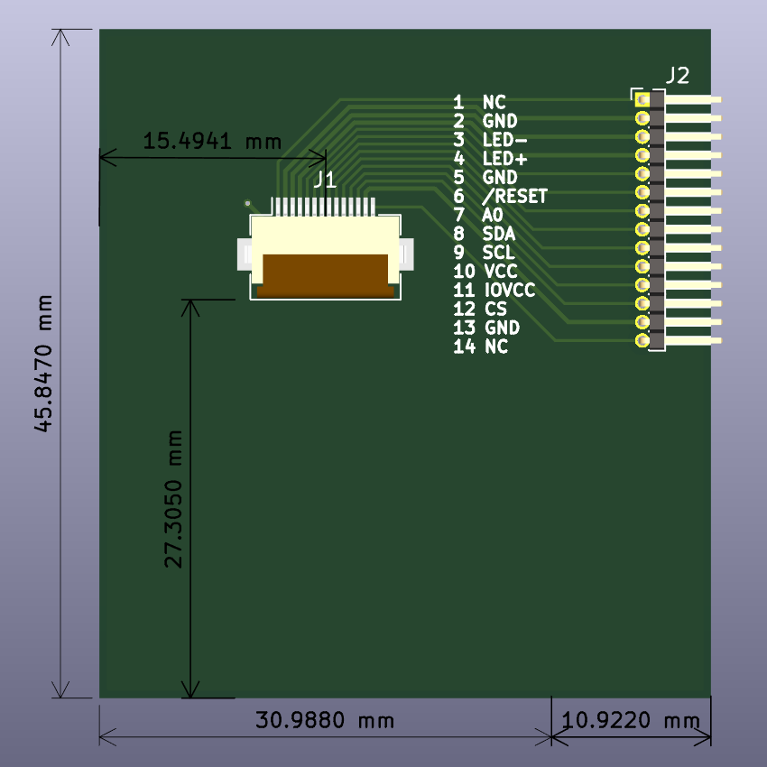
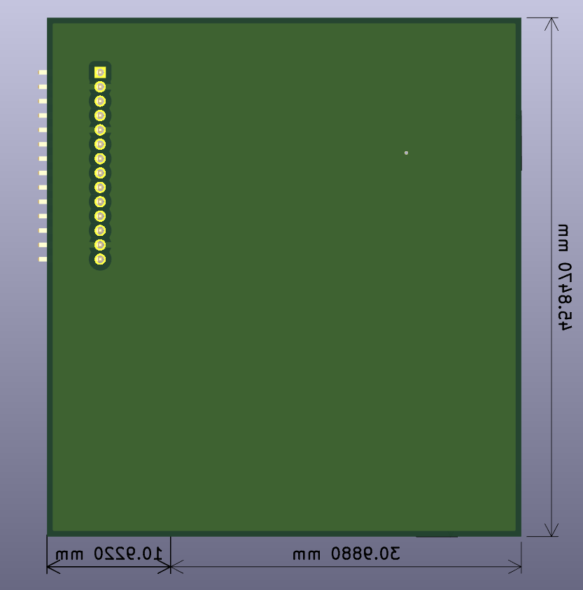

# NixieClock

# Hardware

## Display 1.14"

| Top side                |Bottom side               |
|-----------------------:|:-------------------------:|
|  |  |

  

## Display 1.8"

| Top side                |Bottom side               |
|-----------------------:|:-------------------------:|
|  |  |

  

